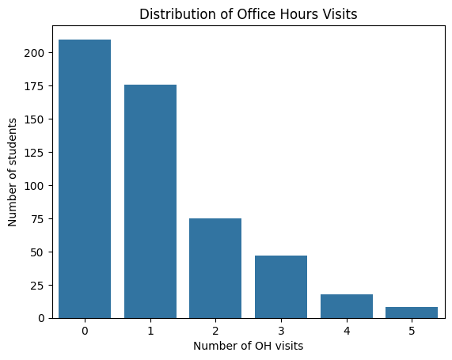
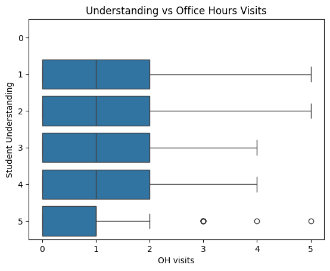
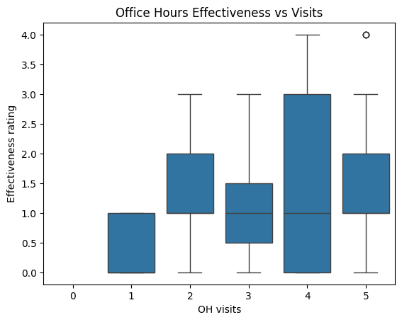

---
# Do not edit the text between these lines!
layout: default
---

<!-- This is a comment. Below, you'll see code for inserting an image. To make this image appear, update <custom-path>. To add an image, save it inside the imgs folder of this repository. -->

# Question

Do office hours improve student understanding?

# Method

Parsed through a COMP110 student survey that to gather data on students' experiences throughout the course.

# Analysis

## Average level of student understanding by # of office hour visits

0    4.552381
1    4.068182
2    3.813333
3    4.085106
4    3.666667
5    3.250000

## Average level of perceived office hour effectiveness by # of office hour visits

0    4.274510
1    5.155963
2    5.260000
3    4.447368
4    5.692308
5    6.833333

## Correlation

	            oh_visits	    oh_effective	understanding
oh_visits	    1.000000	    0.173796	    -0.194340
oh_effective	0.173796	    1.000000	    0.108812
understanding	-0.194340	    0.108812	    1.000000

# Conclusion

Based on the charts and the correlation data, there seems to be a weak relationship between office hour visits and student understanding, as well as office hour visits and office hour effectiveness. Interestingly, there is a weak positive correlation between office hour visits and office hour effectiveness, meaning that students who attend more office hours tend to view them as more effectrive than those who frequent them less often (keep in mind this is just a weak correlation). Overall, the results don't really support the idea that increasing office hour usage through incentives would have a significant impact on student understanding. However, the data may be skewed by the fact that a sizable amount of tickets are not to improve a student's understanding, but to fix a technical issue. A more detailed breakdown of office hour ticket types would be needed to get better insight into how students are interacting with OH and if they feel like they are worth going to.